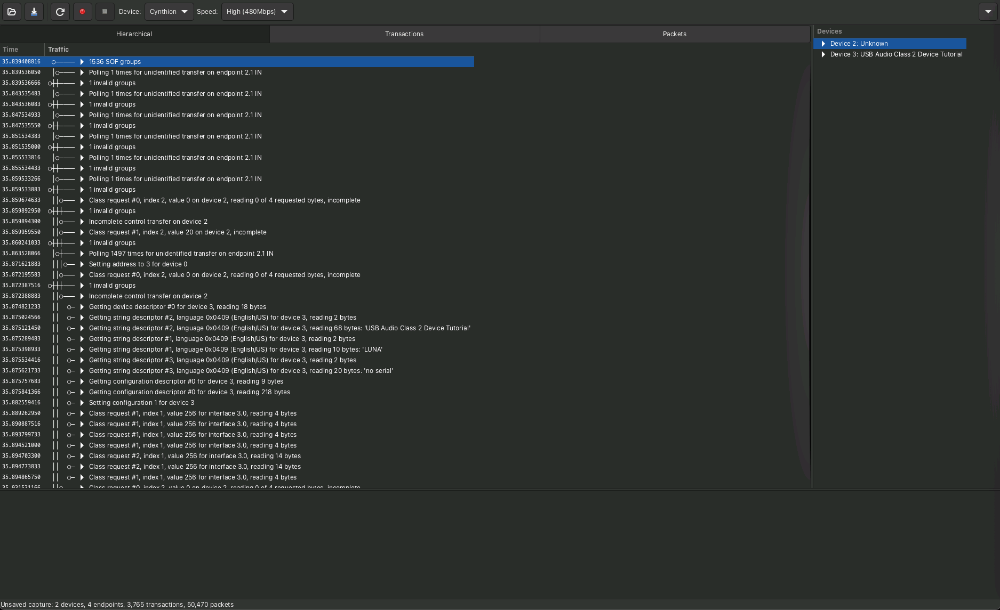

class: center, middle

This page intentionally left blank.

???

#### keys

* h or ?: Toggle the help window
* j: Jump to next slide
* k: Jump to previous slide
* b: Toggle blackout mode
* m: Toggle mirrored mode.
* c: Create a clone presentation on a new window
* p: Toggle PresenterMode
* f: Toggle Fullscreen
* t: Reset presentation timer
* <number> + <Return>: Jump to slide <number>

---

class: center, middle

# USB Audio from Scratch

*USB Audio Class 2.0 on Cynthion with LUNA and Amaranth HDL*

.center[
    
]

---

# Resources

### Cynthion Tutorials

* https://cynthion.readthedocs.io

### LUNA: USB Gateware Library

* https://luna.readthedocs.io/en/latest/

### Amaranth Language & toolchain

* https://amaranth-lang.org/docs/amaranth/

---

class: center, middle

# USB Audio from Scratch

*USB Audio Class 2.0 on Cynthion with LUNA and Amaranth HDL*

<p/><br/>

#### GitHub Repository

https://github.com/greatscottgadgets/cynthion-uac.git

---

# UAC 2.0

.center[
    &nbsp;
    &nbsp;
    
]

.right[
https://www.usb.org/document-library/audio-devices-rev-20-and-adopters-agreement
]

---

## Packetry

.center[
    
]

---

## Sonic Visualiser

.center[
    
]


???
- https://www.sonicvisualiser.org/

---

## Implementation: USB Device

.center[
    
]

---

## Implementation: USB Device

.center[
    
]


---

## Implementation: UAC 2.0 Device Descriptors

.center[
    
]

???

* Use `cyme` to list usb devices -- link to cyme
* cyme -d 0x1209 --lsusb --verbose

---

### Device Descriptor

.float-left[
    
]

---

### Configuration Descriptor

.float-left[
    
]

---

### Interface #0: Standard Audio Control Interface Descriptor

.float-left[
    
]

---

### Interface #0: Standard Audio Control Interface Descriptor

.center[
    
]

---

### Interface #1: Audio Streaming Interface Descriptor

.float-left[
    
]

---

### Interface #1: Audio Streaming Interface Descriptor

.float-left[
    
]

---

### Interface #2: Audio Streaming Interface Descriptor

.float-left[
    
]

---

### Interface #2: Audio Streaming Interface Descriptor

.float-left[
    
]


---

### Putting it all together

.center[
.bigger[]

]

---

### End of Part I

---

### Part II

# USB Audio from Scratch

*USB Audio Class 2.0 on Cynthion with LUNA and Amaranth HDL*

.center[
    
]


---

## Implementation: UAC 2.0 Device

.center[
    
]

---

## Implementation: UAC 2.0 Audio Streams

.center[
    
]


---

### USB Protocol Framing

.scroll[
    
]

---

### UAC 2.0 Audio Stream: Frames

.scroll[
    </img>
]

---

### UAC 2.0 Audio Stream: Packet Format

.scroll[
    </img>
]

---

### UAC 2.0 Synchronisation

.halfway[
    </img>
]

---

### UAC 2.0 Synchronisation

.halfway[
|                   |Synchronous                  | Adaptive                    | Asynchronous      |
|-------------------|-----------------------------|-----------------------------|-------------------|
| Clock Source      | Host SOF                    | Recover Clock from Host SOF | Device Clock      |
| Complexity        | Low                         | Resample and/or PLL         | Buffer Management |
| Flow Control      | None                        | Device Feedback             | Device Feedback   |
| Jitter            | Awful                       | Awful to Okay               | Excellent         |
]

.center[
USB 2.0 Isochronous Transfer Synchronization Modes
]

---

### UAC 2.0 Synchronisation

.scroll[
    </img>
]

---

### Feedback Value Calculation

```python
microframes_per_second = 1000 / 0.125 # = 8000

# 48.0 kHz
sample_rate = 48000
samples_per_microframe = sample_rate / microframes_per_second # = 6 samples / microframe

# 44.1 kHz
sample_rate = 44100
samples_per_microframe = sample_rate / microframes_per_second # = 5.5125 samples / microframe
```

--

```
           5f + 6s
           -------  = 5.5125
           (f + s)


(5 * 39) + (6*41)
-----------------   = 5.5125
     39 + 41
```

--

```
  uf1   uf2   uf3   uf4   uf5   uf6   uf7   uf8  ...   uf77  uf78  uf79  uf80
# (5  +  6  +  5  +  6  +  5  +  6  +  5  +  6 + ... +  5  +  6  +  6  +  6    / 80 = 5.5125
```

---

### Feedback Value Encoding

.halfway[
    </img>
]

.center[
    USB 2.0 Section 5.12.4.2
]

---

### Feedback Value Encoding

.scroll[
    </img>
]

---

## Implementation: Audio for the Audio Streams

.center[
    
]

---

## Low-Pass Filter

.center[
    
]

.center[
*-3dB cutoff frequency = ~ 21922 Hz*
]


---

## Demo: It works!

.center[
    
]

---

## Ob-shout-out

If you like your audio to be Eurorack, FPGA and Open Source; do check out Seb Holzapfel's Tiliqua. Like Cynthion, it's [OSHWA certified](https://certification.oshwa.org/de000144.html) hardware and features:

* Compatible with Amaranth HDL and LUNA.
* Eight channels of 192 kHz, 32-bit, DC-coupled audio.
* [GPDI](https://www.youtube.com/watch?v=xvbrPU7wsK4) video output compatible with most digital monitors/TVs.
* 2x USB ports, 2x PMOD-compatible expansion ports.


.center[
    
    <br/>
    [https://apf.audio](https://apf.audio)
]


---

class: center, middle

# Acknowledgements

Open Culture is a <a href="https://happysleepy.com/art/drawing-thousand-plateaus/introduction/">Rhizome</a> and it's impossible to acknowledge any one community without leaving everyone else out.

Nonetheless a special thank you to everyone in the communities below. This video would have been impossible without the work y'all are doing to put programmable logic in the hands of innovative people everywhere.

### [https://amaranth-lang.org](https://amaranth-lang.org)

### [https://yosyshq.net](https://yosyshq.net)

### [https://radiona.org](https://radiona.org)
